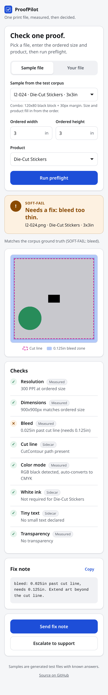
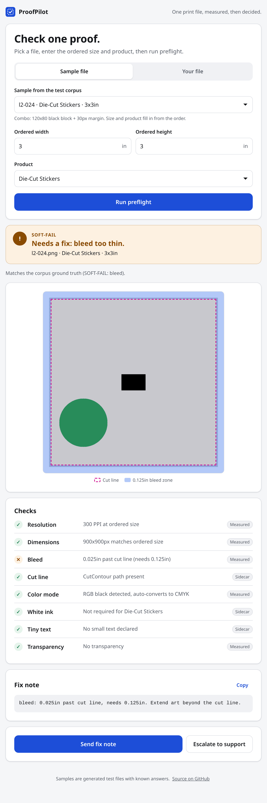
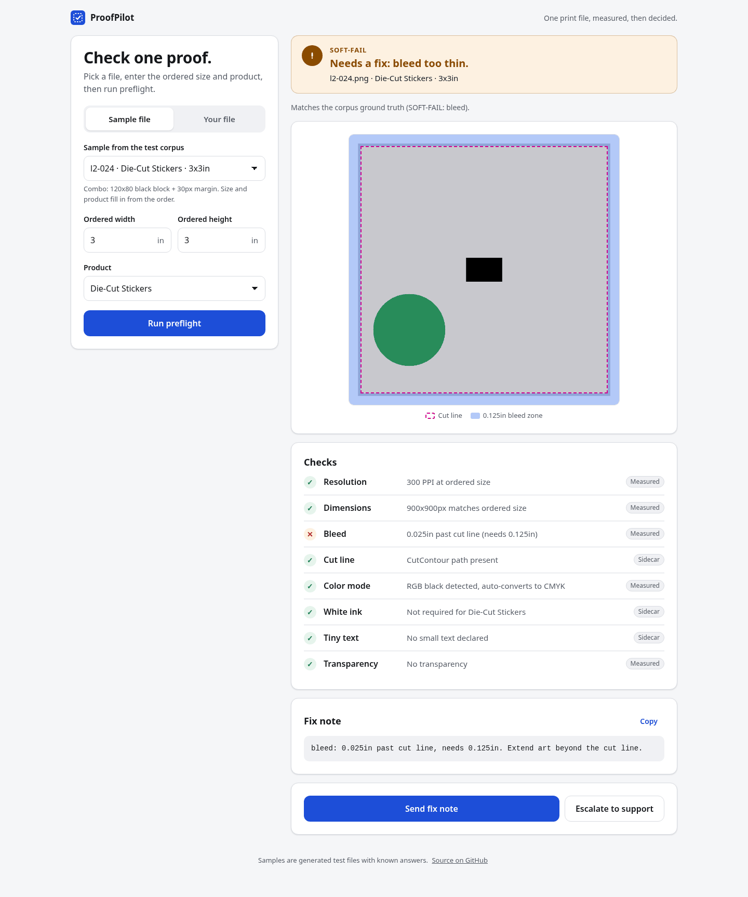

# ProofPilot (proofcut prototype)

Live: https://proofcut.vercel.app

| Phone | Tablet | Desktop |
| --- | --- | --- |
|  |  |  |

## What

ProofPilot checks one print file before an artist touches it.
You pick a sample file or your own PNG or PDF, enter the ordered size, and
pick the product. The app measures the file and shows a verdict with the
number behind every check: PASS or SOFT-FAIL. PASS means the file is clean,
so you press Approve and send. SOFT-FAIL lists each miss with its measured
number, so you press Send fix note or escalate to support. Nothing is
actually sent in this prototype, and there is no account or queue.

## Why

Every upload used to wait until an artist opened it, read it, and typed a
fix note. That took 10 to 25 minutes per file, and most files failed on a
simple measurable fault: low resolution, missing bleed, or no cut line.
Measuring those faults in code takes under a second, so the artist only
sees the exceptions. The app keeps one path on purpose. Login screens,
queues, and dashboards never measured anything, so they were cut.

## Run it

```sh
bun install
bun test          # 233 tests: preflight core, both corpora, API routes, PNG decoder
bun run check     # TypeScript
bun run dev       # http://localhost:3000
bun run build && bun run start
bun run e2e http://localhost:3000   # browser check at 360, 390, 768, 1024, 1440px
```

`bun run e2e` needs a Chromium build: run `bunx playwright-core install chromium`
once, or set `CHROMIUM_PATH` to an existing Chrome binary.

## How it works

src/preflight.ts is the pure function at the center. File plus ordered size
plus product spec go in, and pass plus fails plus measurements come out.
src/preflightFile.ts feeds it. The web app and the test harness call the
same code, so the app shows the same numbers the tests grade.

Where each number comes from, and what the result row says about it:

| Check | Sample PNG | Sample PDF | Your PNG | Your PDF |
| --- | --- | --- | --- | --- |
| Resolution, size | Pixels | Sidecar | Pixels | Not checked |
| Bleed | Pixels (L2), sidecar (L1) | Sidecar | Pixels | Not checked |
| RGB black, transparency | Pixels | Sidecar | Pixels | Not checked |
| Cut line | Sidecar | PDF spot color | Always missing (a PNG has no vector path) | PDF spot color |
| White ink | Sidecar | PDF spot color | Not checked | PDF spot color |
| Smallest text | Sidecar | Sidecar | Not checked | Not checked |

Bleed from pixels uses the white rows at the top edge:
bleed = max(0, 0.125in minus white rows / PPI). The PNG decoder handles
gray, gray plus alpha, RGB, RGBA and palette files at 1 to 16 bits, plain
or interlaced. Your own PDF gets no verdict, because PPI and bleed need a
raster step that this prototype does not have; the cut line, white ink and
page size rows are still measured. Uploads are capped at 4.5 MB, the
request size limit on the free Vercel plan.

src/draft.ts turns the result into the checklist, preview overlays and fix
note. src/catalog.ts lists the sample files from the two corpus manifests.
app/api/preflight runs a sample or an upload, and app/api/demo-image serves
sample previews. Only files named in a manifest can be read.

## Data

All files are synthetic. The scripts in scripts/ generate them with known
answers, and each manifest records the ground truth. No customer files,
company data, or third-party images are in the repo.

- L1 (corpus/): 60 flat-fill die-cut PNGs for geometry, built at 72 to
  349 PPI, including one 72dpi low-resolution file. Bleed and cut line
  are declared in each sidecar. Made by scripts/generate-corpus.ts.
- L2 (corpus-l2-content/): 42 art files across die cut, clear,
  holographic, roll label, and tape. 32 PNGs carry their faults in the
  pixels (white margins, RGB black blocks, transparent patches, text bars)
  and 10 PDFs carry CutContour and white ink spot colors. Made by
  scripts/generate-l2-content.ts.

Text height, cut line, and white ink for PNG samples stay in the sidecar
because pixels do not carry that signal yet. The preview draws the cut line
as a dashed magenta line and shades the 0.125in bleed zone.

Before this update the web app did not use the data this README described:
the sample list showed only the first 5 L1 files, read bleed from the
sidecar instead of the pixels, left the ordered size at 3x3in (so most
samples failed on shape), and uploaded PNGs got no verdict and no pixel
checks. Now the app offers all 102 samples, fills in each one's ordered
size and product, measures PNG pixels as described above, and shows
whether the result matches the manifest ground truth. tests/app-data-path.test.ts
runs every sample through the real API route and checks it against the
manifest.

## Phone, tablet and desktop

One column on phones and tablets, two columns from 960px. No horizontal
scroll from 360px up. Touch targets are at least 44px. Light and dark
follow the device setting. Keyboard focus is always visible, there is a
skip link to the result, and motion stops when the device asks for reduced
motion. axe-core reports no WCAG A or AA issues in light or dark mode.

## Thresholds (frozen for the D2 harness)

| Check | Pass | Soft-fail |
| --- | --- | --- |
| Resolution at ordered size | 300 PPI or more | under 200 PPI (200 to 299 warns) |
| Bleed past cut line | 0.125in or more | under 0.125in |
| Cut line (die-cut, clear, holo) | CutContour spot or vector path | missing |
| White underbase (clear, holo) | present | missing |
| Smallest text | 6pt or more | under 6pt |
| RGB black / transparency | warn with auto-convert note | never a fail on its own |

Verdicts follow the glossary: PASS can auto-draft and, at high confidence,
auto-send with an audit log entry. SOFT-FAIL needs artist review with a marked
preview and never auto-sends. A 50dpi adversarial file never passes, and every
measurement stays within 2 percent of ground truth.

## Evals

The judge checks that wording numbers match code measurements.
Dev has 16 cases. Test has 14 cases. Both scored 100 percent.
Limits, kept: small n, so the true rate could sit lower.
One annotator wrote the labels and the fail cases.
The fail cases are synthetic near-misses, not wild failures.
All 36 natural code outputs passed, which is why mates were built.

## ROI formula plus assumptions

Monthly savings equal labor plus reprints, scaled by year-one capture:

```text
laborMonthly   = ordersPerMonth * (percentManual / 100) * minutesSavedPerOrder * dollarsPerMinute
reprintMonthly = ordersPerMonth * (reprintPct / 100) * costPerReprint
grossMonthly   = laborMonthly + reprintMonthly
capturedMonthly = grossMonthly * (capturePct / 100)
```

All inputs are assumed, never company facts:

| Input | Default | Assumed range |
| --- | --- | --- |
| Orders per month | 100,000 | 80k to 150k |
| Percent manual | 55% | 40 to 70% |
| Minutes saved per order | 11.5 | 8 to 15 min |
| Loaded dollars per minute | $0.60 | $0.45 to $0.75 |
| Reprint percent | 2% | 1 to 3% at $18 to $35 each |
| Year-one capture | 22.5% | 20 to 25% |

Weakest input: orders per month (monthly proof volume).
Confirm it with the company before quoting anything with confidence.

## Guards

Accuracy 90 percent or better, hold rate under 40 percent, preflight p95 under
30 seconds, measurements within 2 percent, zero banned words, 50dpi
adversarial never passes, every auto-send and decision in the audit log.

## What is faked

Static JSON stands in for Guru. Order and Reply calls are mocked, and RIP
runs in shadow mode. One user, no queue.
